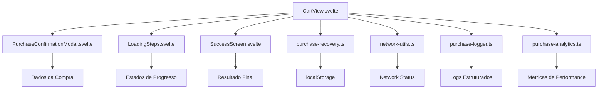
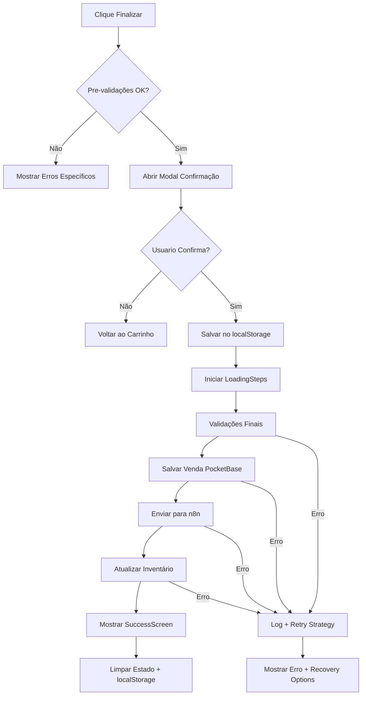

### **Plano de Ação: Finalização da Venda (FEAT-06)**

> **Status:** 📋 **EM PLANEJAMENTO**  
> **Prioridade:** Alta  
> **Dependências:** FEAT-05 (Persistência de Vendas) ✅  
> **Estimativa:** 3-4 dias de desenvolvimento

---

## **📊 Análise do Estado Atual**

**Status:** 🟡 **PARCIALMENTE IMPLEMENTADO** 
- ✅ Função `finalizePurchase()` básica existe no `CartView.svelte`
- ✅ Salvamento de vendas no PocketBase funcionando (FEAT-05)
- ✅ Integração com n8n configurada
- ✅ Sistema de notificações toast implementado
- ⚠️ Falta validações robustas e confirmação de compra
- ⚠️ Tratamento de erros pode ser melhorado
- ⚠️ UX de finalização pode ser mais polida

---

#### **Fase 1: Configuração e Estrutura do Projeto**

Nesta fase inicial, o foco é analisar o ambiente atual e planejar as melhorias necessárias.

1.  **Análise do Ambiente:**
    *   ✅ Verificar estrutura existente em `app/src/lib/components/cart/CartView.svelte`
    *   ✅ Analisar função `finalizePurchase()` atual e identificar gaps
    *   ✅ Verificar dependências existentes: PocketBase SDK, notificações toast
    *   🔄 Identificar pontos de melhoria na UX e robustez

2.  **Planejamento de Novos Utilitários:**
    *   🆕 `purchase-recovery.ts`: Sistema de recuperação de vendas interrompidas
    *   🆕 `network-utils.ts`: Validações de conectividade de rede
    *   🆕 `purchase-logger.ts`: Logs estruturados para debugging
    *   🆕 `purchase-analytics.ts`: Métricas e telemetria de performance

#### **Fase 2: Desenvolvimento dos Componentes da Interface (UI)**

Nesta fase, criaremos novos componentes para melhorar a experiência de finalização.

1.  **Componente `PurchaseConfirmationModal.svelte`:**
    *   **Função:** Modal de confirmação que exibe resumo completo da compra antes da finalização
    *   **Implementação:** 
        - Propriedades: `isOpen`, `purchaseData`, `onConfirm`, `onCancel`
        - Exibir lista de itens, totais, desconto, dados do cliente e forma de pagamento
        - Botões "Confirmar Compra" e "Cancelar/Editar"
        - Validação final antes de permitir confirmação

2.  **Componente `LoadingSteps.svelte`:**
    *   **Função:** Indicador de progresso visual por etapas durante o processamento
    *   **Implementação:**
        - Propriedades: `currentStep`, `steps[]`, `isError`, `errorMessage`
        - Barra de progresso animada
        - Lista de etapas: Validando → Salvando → Processando → Atualizando → Concluído
        - Estados de sucesso/erro por etapa

3.  **Componente `SuccessScreen.svelte`:**
    *   **Função:** Tela de sucesso pós-compra com resumo e ações rápidas
    *   **Implementação:**
        - Propriedades: `saleData`, `onNewSale`, `onPrint`
        - Resumo da venda finalizada
        - Informação se recibo foi enviado
        - Botão "Nova Venda" para reset rápido
        - Opção de imprimir comprovante

#### **Fase 3: Lógica de Negócio e Integração**

Esta é a fase onde melhoramos a lógica de finalização e integramos os novos componentes.

1.  **Aprimoramento da Função `finalizePurchase()`:**
    *   **Pre-validações robustas:**
        1.  Validar carrinho não vazio
        2.  Validar seleção obrigatória de forma de pagamento
        3.  Validar dados do cliente (nome obrigatório, email se quer recibo)
        4.  Verificar conectividade de rede
        5.  Validar se produtos ainda estão disponíveis (double-check)
    *   **Fluxo de confirmação:**
        1.  Mostrar modal de confirmação com resumo
        2.  Aguardar confirmação explícita do usuário
        3.  Salvar estado no localStorage antes processamento
    *   **Processamento com feedback:**
        1.  Mostrar loading steps durante processamento
        2.  Executar etapas: salvar venda → enviar n8n → atualizar inventário
        3.  Log estruturado de cada etapa
        4.  Tratamento granular de erros com retry strategies

2.  **Sistema de Recuperação:**
    *   **Implementar persistência local:**
        - Salvar dados da compra no localStorage antes envio
        - Detectar vendas interrompidas na inicialização
        - Oferecer opção de retomar ou descartar
    *   **Lógica de recuperação:**
        - Validar se dados salvos ainda são válidos
        - Verificar se produtos ainda estão disponíveis
        - Permitir edição antes de tentar novamente

3.  **Melhorias na Experiência:**
    *   **Feedback aprimorado:**
        - Mensagens de sucesso/erro mais específicas
        - Sound feedback opcional para sucesso
        - Animações de transição suaves
    *   **Otimizações de performance:**
        - Debounce em validações
        - Cancelamento de requests em andamento se necessário
        - Cache local de dados de validação

---

## **🏗️ Arquitetura de Componentes**



## **📋 Estrutura de Dados**

```typescript
interface PurchaseConfirmation {
  items: CartItem[];
  subtotal: number;
  total: number;
  discount: { type: 'fixed' | 'percentage'; value: number };
  customer: CustomerData;
  paymentMethod: PaymentMethod;
  timestamp: string;
}

interface PurchaseProgress {
  step: 'validating' | 'saving' | 'processing' | 'updating' | 'complete';
  message: string;
  progress: number; // 0-100
  isError?: boolean;
  errorMessage?: string;
}

interface PurchaseResult {
  success: boolean;
  saleId?: string;
  receiptSent?: boolean;
  inventoryUpdated?: boolean;
  errors?: string[];
  retryable?: boolean;
  recoveryData?: any;
}

interface RecoveryData {
  purchaseData: PurchaseConfirmation;
  timestamp: string;
  attemptCount: number;
  lastError?: string;
}
```

## **⚡ Fluxo Otimizado de Finalização**



## **🎯 Critérios de Sucesso**

### **Performance:**
- ⏱️ Finalização completa em <10 segundos (95% dos casos)
- 🔄 Recovery de vendas interrompidas em <3 segundos
- 📊 Métricas de performance coletadas automaticamente

### **Confiabilidade:**
- ✅ 99% taxa de sucesso em condições normais de rede
- 🛡️ 100% recuperação de vendas salvas localmente
- 🔍 Zero perda de dados em caso de falha

### **Experiência do Usuário:**
- 🎨 Feedback visual claro em todas as etapas
- ⚡ Resposta imediata a ações do usuário (<200ms)
- 🔔 Notificações contextuais e acionáveis
- 📱 Interface responsiva em todos os dispositivos

### **Robustez:**
- 🌐 Funcionamento em conexões lentas/instáveis
- 🔄 Degradação graceful em casos de falha
- 📝 Logs estruturados para debugging eficiente
- 🛠️ Ferramentas de recovery para situações excepcionais

---

## **📈 Próximos Passos**

1. **Criar documentação TODOS** detalhada baseada neste plano
2. **Implementar Fase 1:** Utilitários de base e análise
3. **Implementar Fase 2:** Novos componentes UI
4. **Implementar Fase 3:** Lógica aprimorada e integrações
5. **Testes extensivos** em diferentes cenários
6. **Documentar** learnings e otimizações realizadas